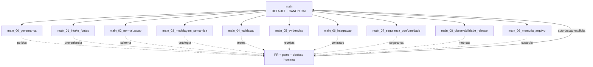

# RAFAELIA — Topologia de branches `main_##` — V1

Estado: `PROPOSED / NON_DESTRUCTIVE / CLAIM_ALLOWED=false`  
Autoridade: `rafaelmeloreisnovo/Mapa`  
Default branch obrigatória: `main`

## 1. Decisão arquitetural

A branch `main` permanece como única fonte canônica e branch default. Ela não será renomeada, substituída nem atualizada automaticamente pelas lanes numeradas.

As branches `main_00_*` até `main_09_*` formam um **hub-and-spoke procedural**: todas derivam diretamente de `main`; a numeração expressa ordem metodológica, não ancestralidade Git. Não se promove conteúdo por uma cadeia `00 -> 01 -> ... -> 09`, porque isso aumenta deriva, conflitos e merges acidentais.

Toda alteração destinada à fonte canônica retorna por Pull Request para `main`, com evidência, falsificador, rollback e decisão humana.

## 2. Imagem estrutural



## 3. Ordem procedural

| Ordem | Branch | Responsabilidade | Saída mínima |
|---:|---|---|---|
| 00 | `main_00_governanca` | autoridade, escopo, vocabulário de claims, política de promoção | decisão e contrato |
| 01 | `main_01_intake_fontes` | recepção, proveniência, quarentena, cadeia de custódia | fonte identificada |
| 02 | `main_02_normalizacao` | nomes, schemas, metadados, deduplicação | objeto normalizado |
| 03 | `main_03_modelagem_semantica` | ontologia, relações, floresta e rotas | modelo navegável |
| 04 | `main_04_validacao` | lint, schemas, testes positivos/adversariais, falsificadores | relatório de validação |
| 05 | `main_05_evidencias` | hashes, receipts, ambientes, reprodutibilidade | pacote de evidência |
| 06 | `main_06_integracao` | contratos entre módulos/repositórios e staging lógico | integração candidata |
| 07 | `main_07_seguranca_conformidade` | ameaça, privacidade, dependências, LGPD e controles | parecer de risco |
| 08 | `main_08_observabilidade_release` | métricas, artefatos, regressão, release candidate | decisão de release |
| 09 | `main_09_memoria_arquivo` | catálogo, retenção, append-only, arquivo e restauração | checkpoint longitudinal |

## 4. Invariantes

1. `main` continua default e canônica.
2. Toda lane numerada deve existir no manifesto versionado.
3. Nenhuma lane pode promover automaticamente conteúdo para `main`.
4. Toda PR de uma lane para `main` exige: `source`, `claim_state`, `evidence`, `falsifier`, `rollback` e `decision`.
5. `TOKEN_VAZIO` é aceito como estado auditável; lacuna não pode ser convertida em sucesso por ausência de erro.
6. Force-push e exclusão devem ser bloqueados por ruleset nas branches `main` e `main_[0-9][0-9]_*`.
7. A lane deve ser sincronizada com `main` antes de uma promoção, sem reescrita destrutiva de histórico.
8. Branches de trabalho continuam curtas e específicas; as lanes são pontos de controle, não depósitos permanentes.

## 5. Fluxo de trabalho

```text
intencao
  -> selecionar lane
  -> criar branch curta de trabalho
  -> implementar e testar
  -> PR para a lane correspondente
  -> produzir receipt e falsificador
  -> sincronizar lane com main
  -> PR lane -> main
  -> autorizacao humana
  -> merge
  -> checkpoint em main_09_memoria_arquivo
```

## 6. Rulesets recomendados

Para `main`:

- exigir Pull Request;
- exigir checks aprovados;
- bloquear force-push e exclusão;
- exigir resolução de conversas;
- exigir histórico linear quando compatível;
- aplicar também a administradores, salvo recuperação documentada.

Para `main_[0-9][0-9]_*`:

- restringir atualizações diretas;
- exigir Pull Request;
- bloquear exclusão e force-push;
- exigir o check `branch-topology / validate`;
- impedir bypass não auditado.

Rulesets podem aplicar múltiplas políticas simultaneamente e são preferíveis quando várias regras precisam atingir o mesmo conjunto de branches. A aplicação nas configurações do GitHub permanece `TOKEN_VAZIO_EXTERNAL_SETTING` até confirmação observável.

## 7. Limites

Esta arquitetura organiza autoridade e fluxo, mas não prova qualidade científica, segurança, compilação física ou reprodução independente. Cada domínio mantém seus próprios gates.

```text
claim_allowed=false
publication_ready=false
full_system_release=false
```
