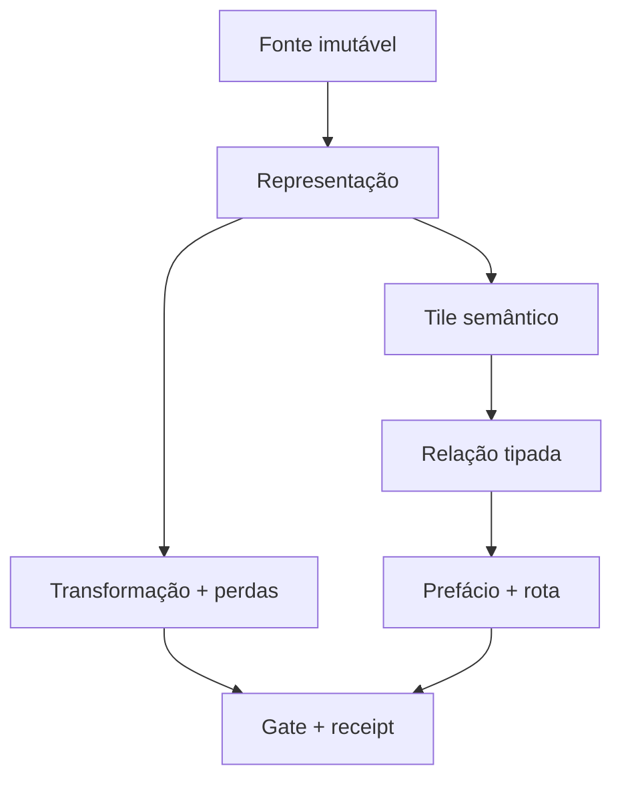

# MULTIMODAL_CAVE_SEED_V1 — índice navegável

Estado: `VERIFIED_LIMITED`  
Claim global: `claim_allowed=false`  
Baseline Mapa: `44cb3cefdb0434b8f3c6f7361cb9c3850dbb7381`  
Seed: `data/multimodal/MULTIMODAL_CAVE_SEED_20260822.v1.json`

Este índice materializa uma primeira “caverna de informação”: cada fonte tem
identidade imutável, representação, regiões semânticas, relações tipadas,
incerteza, rota de leitura e limite de evidência. Os bytes das imagens não são
copiados para o repositório.

## Mapa mínimo



A transformação pode mudar o hash da representação derivada, mas não pode
trocar silenciosamente a raiz de linhagem. Containment, dependência e
prefácio-de-prefácio são acíclicos. Ciclos só são permitidos no grafo semântico
ou de feedback quando seu tipo é explícito.

## Fontes observadas

O MIME abaixo foi detectado nos bytes. Ele não foi inferido pela extensão.

| ID | Papel bounded | Dimensão | Bytes | Extensão | MIME detectado | SHA-256 |
|---|---|---:|---:|---|---|---|
| `MMO-01` | malha de hyperformas | 1536×1536 | 579206 | `.png` | `image/jpeg` | `261d03265f178d43a5e74ba429b0b454df4efc34caa9b51a269024dffd9dc077` |
| `MMO-02` | árvore taxonômica | 1024×1536 | 433300 | `.png` | `image/jpeg` | `317b8421bce269f856c6beb4a913a81ebcbe3c8c9ebf87e59e73b0c876c103b6` |
| `MMO-03` | fractal e poliedro | 1536×1536 | 451535 | `.png` | `image/jpeg` | `acdcf8f01e77648fb460f9cd0f0da269bc77a5c84be6d2f1cbe466ecfb2e03f2` |
| `MMO-04` | rede radial recursiva | 1536×1536 | 744702 | `.jpg` | `image/jpeg` | `e9a700ac3d3b85d7bfb840190e294464a44c10ed8015581a31528ea3d4787bb6` |
| `MMO-05` | cubo de projeção | 1536×1536 | 399906 | `.png` | `image/jpeg` | `6c6e02c47dcb9c4a9611e5ec676822013cf31a67d4151a6eb20e9ccef5fde774` |
| `MMO-06` | diagrama de bits/paridade | 1536×1536 | 640248 | `.png` | `image/jpeg` | `30ebe3d8833142a2d88e3787f12299a1be5924ee11dfec84bcc675b7d35d8863` |
| `MMO-07` | forma de onda visual | 1536×1536 | 731307 | `.png` | `image/jpeg` | `96948082a5211397c34914230c3491c9bf3dad605b4cafbea95f70676c2d955e` |
| `MMO-08` | Paper 6 / déficit quadrático | 1087×1536 | 421327 | `.png` | `image/jpeg` | `0a5cb30c19fb4cc85aac28b49db35a54a8595d84af5fe57b8fe0523ec32ee074` |
| `MMO-09` | catedral de tiles | 1536×1536 | 1038585 | `.png` | `image/jpeg` | `44c895230b33b420d76650dc92fd1569a92955f8bb19421890981b3e459c47fe` |
| `MMO-10` | retrato em moldura simbólica | 1024×1536 | 595992 | `.png` | `image/jpeg` | `dd31404c908f8fd261906651df864928d2603e076a5f2319fe4bb271f51a7683` |

`MMO-08` e `MMO-09` têm igualdade exata de SHA-256 e bytes com os papéis
`paper_6_deficit_quadratico` e `catedral_fractal_celular` já presentes em
`data/sementeira/cohesion/hyperformas-source-manifest-2026-07-28.json`.
Isso é alias de bytes, não evidência independente.

## Rotas de leitura

| Prefácio | Fontes | Pergunta | Exclusão decisiva |
|---|---|---|---|
| `PREFACE-GEOMETRY` | 1, 3, 5, 8 | O que é desenho e o que é invariante calculável? | Rótulo dimensional não define espaço ou mapa. |
| `PREFACE-CODEC` | 6 | Como projetar 10 bits em 8 sem apagar o resíduo? | Paridade não substitui dois bits arbitrários. |
| `PREFACE-SEMANTIC` | 2, 4, 7, 9 | Como árvores, ciclos e mosaicos viram rotas tipadas? | Proximidade visual não cria causalidade. |
| `PREFACE-PRIVACY` | 10 | Que operações são bloqueadas pelo retrato? | Sem identidade, crop ou inferência cultural/religiosa. |

Os prefácios de profundidade 2 refinam fórmula, roundtrip e catedral de tiles.
O validator bloqueia ciclos e profundidade acima do limite do seed.

## Invariantes exatos demonstrados localmente

### Roundtrip 10-bit → 8-bit + resíduo

Para todo inteiro `x10` em `0..1023`:

```text
q8 = x10 >> 2
r2 = x10 & 3
x10 = (q8 << 2) | r2
```

O gate percorre os 1.024 estados. Descartar `r2` perde informação; um único bit
de paridade não representa os quatro resíduos arbitrários.

### Fórmula da imagem 1

`sqrt(div(3,2))` e `div(sqrt(3),2)` são ASTs distintos:

- `sqrt(3/2) ≈ 1.224744871391589`
- `sqrt(3)/2 ≈ 0.8660254037844386`

### Matriz da imagem 8

Para a matriz inteira exibida `A`, a aritmética racional exata verifica:

```text
A² = 9I
M = A/4
M² = 9I/16
M⁻¹ = 16M/9
```

O escopo é somente essa matriz 3×3. A metáfora de Venturi não é promovida a
equivalência física.

## Transformações registradas

| Transformação | Estado | Reversibilidade | Limite |
|---|---|---|---|
| inspeção de cabeçalho/hash | `VERIFIED_LIMITED` | sem mutação | ferramenta local; sem claim externo |
| 10-bit → 8+2 | `VERIFIED_LIMITED` | exata no domínio | codec escalar, não codec de imagem |
| JPEG → PNG | `TOKEN_VAZIO_EXECUTION` | não recupera bitstream JPEG | nenhum derivado criado |
| rotação 90° | `TOKEN_VAZIO_EXECUTION` | condicional | re-encoding/metadata fora do inverso geométrico |
| overlay alfa | `TOKEN_VAZIO_EXECUTION` | não, se achatado | camadas devem permanecer separadas |
| dobra/projeção | `TOKEN_VAZIO_EXECUTION` | desconhecida | mapa, domínio e codomínio ausentes |
| pirâmide semântica | `REFERENCE` | anotação, não reconstrução | bounds manuais normalizados |

## Gaps preservados

- `GAP-MEDIA-ORIGINALS`: nenhum GIF, RAW, VOB ou stream de legendas.
- `GAP-RASTERIZATION-LINEAGE`: pipeline anterior e parâmetros JPEG ausentes.
- `GAP-SEMANTIC-OCR`: nenhuma transcrição autoritativa por região.
- `GAP-AUDIO-SAMPLES`: a forma de onda não tem áudio, taxa ou eixo temporal.
- `GAP-VIDEO-SUBTITLE-MAP`: sem container, packets, capítulos ou timestamps.
- `GAP-MANIFOLD-PROOF`: charts e mapas de transição ainda não definidos.
- `GAP-OVERLAY-EXECUTION`: derivados de rotação/dobra/overlay não existem.
- `GAP-PORTRAIT-IDENTITY-RIGHTS`: identidade, consentimento e direitos ausentes.
- `GAP-SCIENTIFIC-VALIDATION`: analogias não têm experimento independente.

## Artefatos e gates

- Schemas: `schemas/multimodal-*.schema.json`,
  `schemas/semantic-tile.v1.schema.json` e
  `schemas/route-preface.v1.schema.json`.
- Validator: `scripts/validate_multimodal_cave_seed.py`.
- Testes: `tests/test_multimodal_cave_seed.py`.
- Gate remoto: `.github/workflows/multimodal-cave-seed-v1.yml`.
- Receipt local: `data/receipts/multimodal-cave-seed.local.20260822T*.receipt.json`.
- [Espelho editorial no Google Drive](https://docs.google.com/document/d/17O7mEaLXpiypz4rufGf_hx1G-jCranCzXjP1CQpNqlY).

Reprodução local:

```bash
python3 -m py_compile \
  scripts/validate_multimodal_cave_seed.py \
  tests/test_multimodal_cave_seed.py

python3 -m unittest -v tests/test_multimodal_cave_seed.py

python3 scripts/validate_multimodal_cave_seed.py \
  --repo-root . \
  --seed data/multimodal/MULTIMODAL_CAVE_SEED_20260822.v1.json
```

## R3

`F_ok`: fontes, contratos, tiles, relações, rotas, privacidade, álgebra e
roundtrip foram materializados e validados no escopo local.

`F_gap`: originais multimídia, derivados, direitos, autoridades externas,
manifold e claims científicos continuam abertos.

`F_next`: observar o gate remoto no head exato do PR; depois executar uma única
transformação não sensível com hashes de entrada/saída e receipt de perdas.
